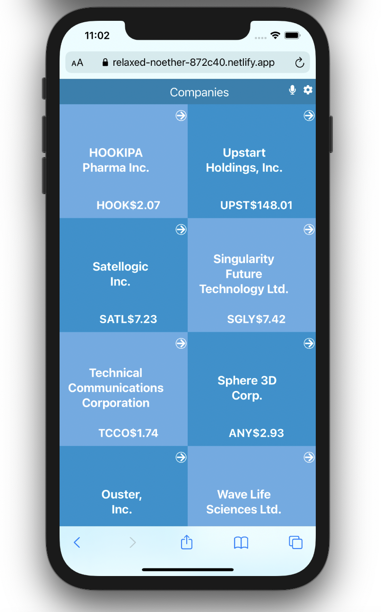
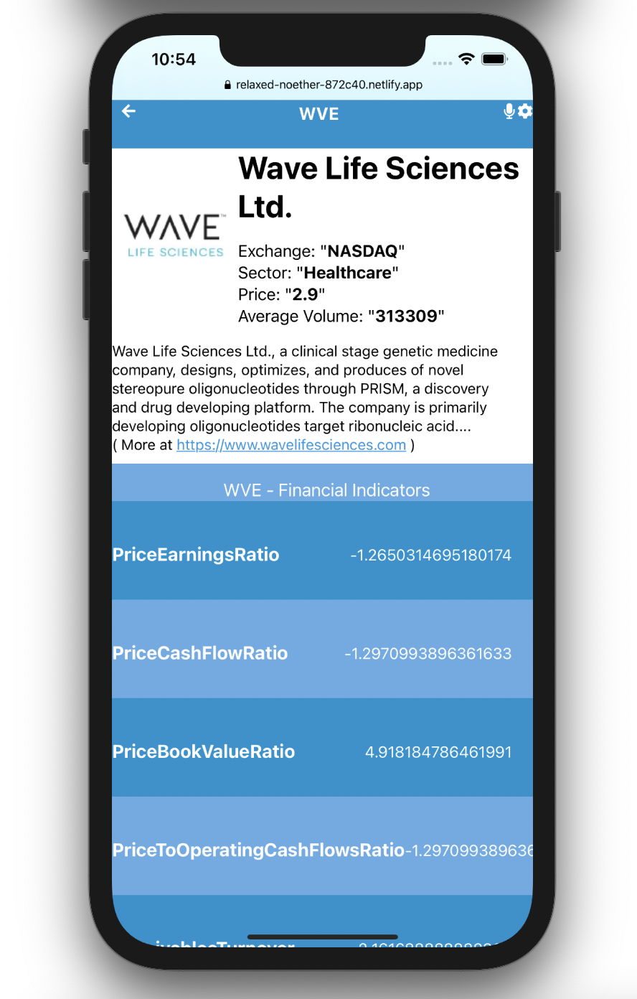

#  React Capstone

> Companie's Metrics App is single-paged application (SPA) that displays statics of Companies arround the world. The data being showcased was fetched from the `Narrativa_API`. The Home page shows the list of countries that could be filtered with the country name. Details page show detailed data for a selected country. Every page has a unique route within the SPA.

## Homepage and Details page

## Built With

- React
- DOM6
- localStorage
## Live Demo

[Live Demo Link](https://relaxed-noether-872c40.netlify.app)

## video Demo

[Video Demo Link]()

## Author

👤 **Abror Mukimov**

- [GitHub](https://github.com/abrormukimov)
- [Twitter](https://twitter.com/abrormukimov)
- [LinkedIn](https://www.linkedin.com/in/abror-mukimov/)

## Getting Started
- run `npm install` to install all dependencies
- run `npm start` to run the server

### Prerequisites:

- Web browser
- Code Editor
- Live Server Extension

### Cloning the repo to your local system (If you already have git, installed in your system):

- [Copy this link](git@github.com:abrormukimov/react-capstone.git)
- Open your terminal or command line
- Run "git clone [Paste this link](git@github.com:abrormukimov/react-capstone.git)"
- Open the folder with your code editor
- Now You can edit the code and check the changes in the browser using Live Server

### Check linter errors:

- Install npm
- For HTML: Run npx hint .
- For CSS: Run npx stylelint “**/*.css”
- for javascript Run npx eslint .

## 🤝 Contributing

Contributions, issues, and feature requests are welcome!

Start by:

- Forking the project
- Cloning the project to your local machine
- cd into the react-capstone project directory
- Run git checkout -b your-branch-name
- Make your contributions
- Push your branch up to your forked repository
- Open a Pull Request with a detailed description to the development branch of the original project for a review

Feel free to check the [issues page](https://github.com/abrormukimov/react-capstone/issues), contribute to the Project by creating an issue.

## Show your support

Give a ⭐️ if you like this project!

## Acknowledgments
- Project inspired by Microverse Program
- Thanks for this Website Design "Nelson Sakwa on Behance"
